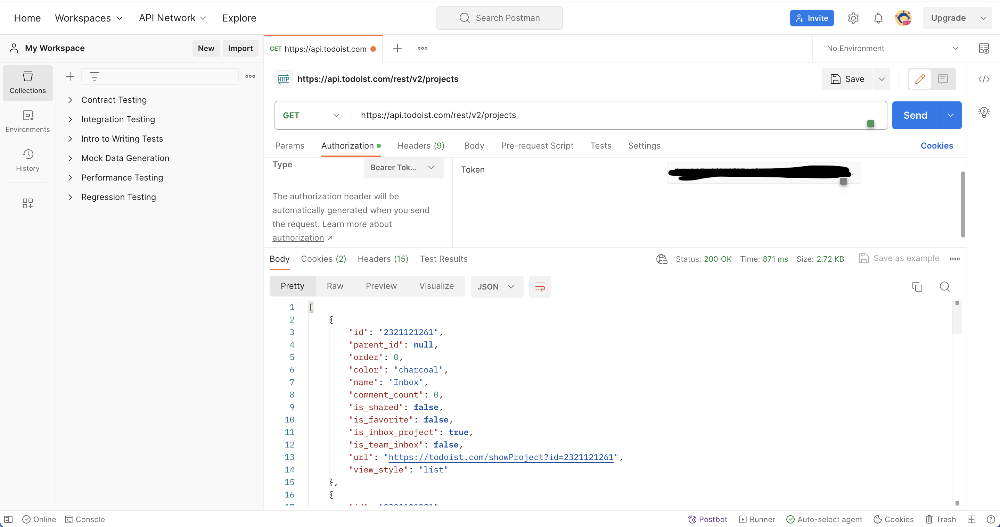

# Time! Todo (Time Management & To-do List Project)

## Project Description
Welcome to our Time Management & To-Do List Project! This application is designed to help users effectively manage their tasks through a minimalist design and user-friendly features. It's perfect for students, professionals, or anyone looking to streamline their day.

## Key Features

### User Interface 
- **Minimalist Design**: A clean, visually pleasing user interface that's easy to navigate.

### To-Do List Management
- **Add Project**: Organize tasks into different projects.
- **Get All Projects**: View all projects in one place.
- **Add Task**: Easily add tasks to projects.
- **Get All Tasks**: Overview all tasks within a project.

### Use Cases
- **Example**: Jacob, a college student, manages his course tasks by creating a separate project for each course.

## API Documentation
We use the [Todoist API](https://developer.todoist.com/rest/v2/#overview) for seamless task management and synchronization.

## Screenshot of API:

## Example Output (Java Code)

## Final Thoughts
Our goal is to make daily task management simpler and more productive. We're excited to see how our app helps you achieve your goals!

---

[Back to Top](# Time! Todo (Time Management & To-do List Project))
